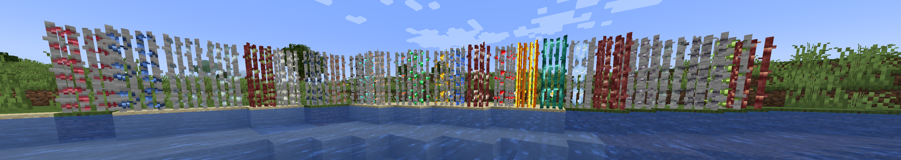
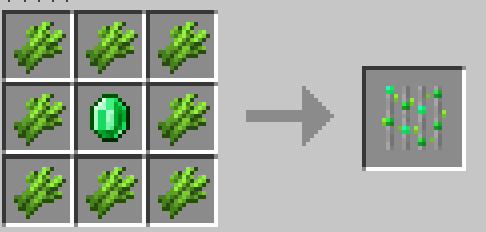
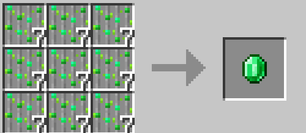
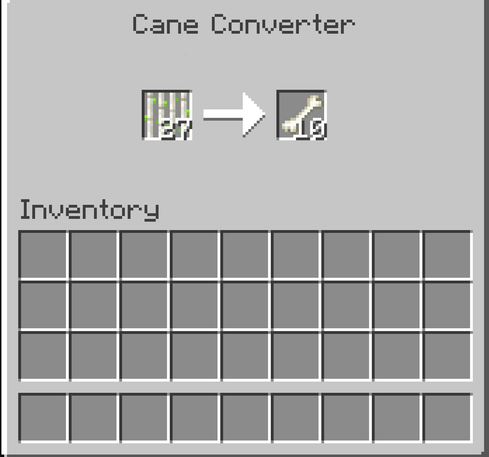

# Minerais Cultivables (Growable Ores)

Le mod GrowableOres est une modification qui contient une bonne quantité de contenu pour vous aider à cultiver des minerais.

## Traduction
Vous pouvez soumettre des traductions pour GrowableOres via notre page [Crowdin](https://crowdin.com/project/growable-ore). Pensez à nous aider si vous parlez couramment une langue quelconque ! Alternativement, les traductions peuvent également être soumises via des pull requests.

## Ce mod prend en charge :
Applied Energistcs 2 !  
TechReborn !  
BetterEnd !  
Powah Rearchitected !(Version du mod Fabric 1.3.0+, Forge1.1.0+)  
Modern Industrialization !(Version du mod Fabric 1.4.0+)  
Industrial Revolution !(Version du mod Fabric 1.4.1+)  
Thermal Series !(Version du mod Forge 1.2.0+)  
Create !(Version du mod Fabric 1.6.0+ , Forge 1.2.0+)  
IC2 Classic !(Version du mod Fabric 1.6.0+ , Forge 1.3.0+)  
Ad Astra !(Version du mod Fabric 1.6.0+ , Forge 1.2.0+)  
Super Apple !  
Maple !  
BotanyPots !(Version du mod Fabric 1.8.0+ ou 1.7.0+(1.20.1), Forge 1.6.0+, Neoforge 1.6.0+)  
Mekanism !(Version du mod 2.4.0+)  
BetterNether !(Version du mod 2.4.0+)  
Energized Power !(Version du mod 2.4.0+)

Version du mod 3.0.0+  
Biomes O' Plenty !
Draconic Evolution !
Extreme Reactors !
Galosphere！
Gobber2！
GregTechCEu Modern !
Mana and Artifice !
Mystical Agradditions !
MysticalAgriculture !
Railcraft！
RFTools！
Tinkers' Construct！

## Fonctionnalités

Le mod GrowableOres implémente essentiellement des cultures de canne à sucre spécialisées qui, au lieu de faire pousser de la canne à sucre traditionnelle, font pousser les minerais que vous devriez normalement miner en fournissant beaucoup d'efforts. Grâce à ce mod, vous pourrez essentiellement cultiver vos minerais comme des cultures traditionnelles, ce qui vous permettra d'acquérir tous les minerais dont vous avez besoin de manière extrêmement pratique. Le mod a des cannes à minerai pour presque tous les minerais de Minecraft dont vous pourriez avoir besoin, du charbon au diamant, et tant que vous l'utilisez correctement, il satisfera certainement une bonne partie de vos besoins en minerais.

Version du mod 3.0.0 ou 2.5.0+  
Ajoutez un tag pour les blocs et fluides de culture personnalisés.  
Configurez la hauteur des cannes à minerai.  
Plantez des cannes à minerai au bord des lacs de lave.  
Activez la croissance des cannes à minerai avec de la poudre d'os dans la configuration.

## Recettes

Vous pouvez vérifier les recettes dans le mod REI ou JEI.

Un simple :  

Si vous voulez obtenir du minerai en utilisant moins de cannes, vous pouvez choisir le mod [GrowableOres Extension(lien Curseforge)](https://www.curseforge.com/minecraft/mc-mods/growableores-extension)) qui peut vous aider à obtenir un minerai pour une canne.

<AdUnit />

