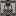

# Machines de traitement

Les machines de traitement transforment les matériaux. La plupart sont des machines alimentées avec 1 emplacement d'entrée, 1 emplacement de sortie, un emplacement de batterie et 4 emplacements d'amélioration. Le coût EU par défaut est de **32 E/t** et le temps de traitement par défaut est de **72 ticks** (3,6 secondes), sauf indication contraire.

## Convertisseur de cannes (Bloc d'alchimie)

Un convertisseur simple 1 entrée → 1 sortie utilisé pour transformer les **cannes de minerai** en lingots. Machine de Niveau 1.

**Utilisation :** Placez une canne de minerai dans l'emplacement d'entrée, alimentez la machine et récupérez le lingot.

### Recettes

| Entrée | Sortie |
|--------|--------|
| Canne de minerai de bronze | Lingot de bronze |
| Canne de minerai de plomb | Lingot de plomb |
| Canne de minerai sacré | Lingot sacré |
| Canne de minerai d'argent | Lingot d'argent |
| Canne de minerai d'acier | Lingot d'acier |
| Canne de minerai d'étain | Lingot d'étain |

## Macérateur

Réduit en poudre les objets et les minerais. Machine de Niveau 1.

**Utilisation :** Mettez des objets dans l'emplacement d'entrée. Les minerais deviennent des minerais broyés ; les lingots et autres matériaux deviennent des poussières.

### Recettes

| Entrée | Sortie |
|--------|--------|
| Laine blanche | Fil ×2 |
| Charbon | Poussière de charbon |
| Bloc de charbon | Poussière de charbon ×9 |
| Bloc de redstone | Redstone ×9 |
| Gravier | Silex |
| Glowstone | Poussière de glowstone ×9 |
| Bloc de quartz | Quartz ×4 |
| Glace | Boule de neige |
| Os | Poudre d'os ×4 |
| Argile | Poussière d'argile ×2 |
| Lingot d'acier | Poussière de fer ×2 |
| Grès | Sable ×2 |
| Pierre | Bloc de pierre ×2 |
| Pierre | Pierre taillée ×2 |
| Bâton de blaze | Poudre de blaze ×5 |
| Fer brut / Minerai de fer | Fer broyé ×2 |
| Plaque de fer | Poussière de fer |
| Plaque de fer dense | Poussière de fer ×9 |
| Fer purifié / Fer broyé | Poussière de fer |
| Lingot de fer | Poussière de fer |
| Or brut / Minerai d'or | Or broyé ×2 |
| Plaque d'or | Poussière d'or |
| Plaque d'or dense | Poussière d'or ×9 |
| Or purifié / Or broyé | Poussière d'or |
| Lingot d'or | Poussière d'or |
| Lingot de bronze | Poussière de bronze |
| Plaque de bronze | Poussière de bronze |
| Plaque de bronze dense | Poussière de bronze ×9 |
| Diamant | Poussière de diamant |
| Cuivre brut / Minerai de cuivre | Cuivre broyé ×2 |
| Plaque de cuivre | Poussière de cuivre |
| Plaque de cuivre dense | Poussière de cuivre ×9 |
| Cuivre purifié / Cuivre broyé | Poussière de cuivre |
| Lingot de cuivre | Poussière de cuivre |
| Sacré brut / Minerai sacré | Sacré broyé ×2 |
| Plomb brut / Minerai de plomb | Plomb broyé ×2 |
| Plaque de plomb | Poussière de plomb |
| Plaque de plomb dense | Poussière de plomb ×9 |
| Plomb purifié / Plomb broyé | Poussière de plomb |
| Lingot de plomb | Poussière de plomb |
| Étain brut / Minerai d'étain | Étain broyé ×2 |
| Plaque d'étain | Poussière d'étain |
| Plaque d'étain dense | Poussière d'étain ×9 |
| Étain purifié / Étain broyé | Poussière d'étain |
| Lingot d'étain | Poussière d'étain |
| Lapis-lazuli | Poussière de lapis |
| Bloc de lapis | Poussière de lapis ×9 |
| Obsidienne | Poussière d'obsidienne |
| Plaque d'obsidienne | Poussière d'obsidienne |
| Plaque d'obsidienne dense | Poussière d'obsidienne ×9 |
| Minerai d'iridium | Fragment d'iridium ×9 |

## Compresseur

Compresse les matériaux en plaques, plaques denses, blocs et autres produits. Machine de Niveau 1.

### Recettes

| Entrée | Sortie |
|--------|--------|
| Lingot de fer ×9 | Bloc de fer |
| Poussière de fer | Plaque de fer |
| Plaque de fer ×9 | Plaque de fer dense |
| Petite poussière de fer ×9 | Poussière de fer |
| Lingot d'étain ×9 | Bloc d'étain |
| Poussière d'étain | Plaque d'étain |
| Plaque d'étain ×9 | Plaque d'étain dense |
| Petite poussière d'étain ×9 | Poussière d'étain |
| Lingot de cuivre ×9 | Bloc de cuivre |
| Poussière de cuivre | Plaque de cuivre |
| Plaque de cuivre ×9 | Plaque de cuivre dense |
| Petite poussière de cuivre ×9 | Poussière de cuivre |
| Lingot d'or ×9 | Bloc d'or |
| Poussière d'or | Plaque d'or |
| Plaque d'or ×9 | Plaque d'or dense |
| Petite poussière d'or ×9 | Poussière d'or |
| Lingot d'argent ×9 | Bloc d'argent |
| Petite poussière d'argent ×9 | Poussière d'argent |
| Lingot de plomb ×9 | Bloc de plomb |
| Poussière de plomb | Plaque de plomb |
| Plaque de plomb ×9 | Plaque de plomb dense |
| Petite poussière de plomb ×9 | Poussière de plomb |
| Lingot de bronze ×9 | Bloc de bronze |
| Poussière de bronze | Plaque de bronze |
| Plaque de bronze ×9 | Plaque de bronze dense |
| Petite poussière de bronze ×9 | Poussière de bronze |
| Lingot d'acier ×9 | Bloc d'acier |
| Plaque d'acier ×9 | Plaque d'acier dense |
| Redstone ×9 | Bloc de redstone |
| Lapis-lazuli ×9 | Bloc de lapis |
| Poussière de lapis | Plaque de lapis |
| Plaque de lapis ×9 | Plaque de lapis dense |
| Petite poussière de lapis ×9 | Poussière de lapis |
| Lingot d'alliage ×9 | Plaque d'alliage |
| Poussière d'energium ×9 | Cristal d'énergie |
| Boule de charbon | Bloc de charbon |
| Maille de carbone | Plaque de carbone |
| Brique du Nether ×4 | Briques du Nether |
| Petite poussière d'obsidienne ×9 | Poussière d'obsidienne |
| Poussière d'obsidienne | Plaque d'obsidienne |
| Plaque d'obsidienne ×9 | Plaque d'obsidienne dense |
| Brique ×4 | Briques |
| Sable ×4 | Grès |
| Poudre de blaze ×5 | Bâton de blaze |
| Poussière de glowstone ×4 | Glowstone |
| Boule de neige ×4 | Bloc de neige |
| Morceau de charbon | Diamant |
| Bloc de neige | Glace |
| Glace ×2 | Glace compactée |
| Boule d'argile ×4 | Argile |
| Fragment d'iridium ×9 | Minerai d'iridium |
| Minerai d'iridium | Lingot d'iridium |
| Petite poussière de lithium ×9 | Poussière de lithium |
| Petite poussière de soufre ×9 | Poussière de soufre |
| Sacré broyé | Lingot sacré |
| Cellule vide | Cellule d'air |

## Formeur de métal

Une machine à trois modes : **Laminage**, **Découpe** et **Extrusion**. Changez de mode dans l'interface. Machine de Niveau 1.

**Utilisation :** Sélectionnez le mode, insérez le matériau approprié et traitez.

### Recettes de laminage

| Entrée | Sortie |
|--------|--------|
| Lingot de bronze | Plaque de bronze |
| Plaque de bronze | Coque de bronze ×2 |
| Lingot de fer | Plaque de fer |
| Plaque de fer | Coque de fer ×2 |
| Lingot d'or | Plaque d'or |
| Plaque d'or | Coque d'or ×2 |
| Lingot de cuivre | Plaque de cuivre |
| Plaque de cuivre | Coque de cuivre ×2 |
| Lingot d'acier | Plaque d'acier |
| Plaque d'acier | Coque d'acier ×2 |
| Lingot de plomb | Plaque de plomb |
| Plaque de plomb | Coque de plomb ×2 |
| Lingot d'étain | Plaque d'étain |
| Plaque d'étain | Coque d'étain ×2 |

### Recettes de découpe

| Entrée | Sortie |
|--------|--------|
| Plaque d'étain | Câble en étain ×3 |
| Plaque de fer | Câble HV ×4 |
| Plaque d'or | Câble en or ×4 |
| Plaque de cuivre | Câble en cuivre ×2 |

### Recettes d'extrusion

| Entrée | Sortie |
|--------|--------|
| Lingot de cuivre | Câble en cuivre ×3 |
| Lingot d'étain | Câble en étain ×3 |
| Lingot d'or | Câble en or ×4 |
| Lingot de fer | Câble HV ×4 |
| Plaque d'iridium | Lingot d'iridium |

## Extracteur

Extrait des matériaux tels que le caoutchouc et le soufre. Machine de Niveau 1.

### Recettes

| Entrée | Sortie |
|--------|--------|
| Argile | Boule d'argile ×4 |
| Bloc de neige | Boule de neige ×4 |
| Briques | Brique ×4 |
| Briques du Nether | Brique du Nether ×4 |
| Bûche de caoutchouc | Caoutchouc |
| Bûche à caoutchouc | Caoutchouc |
| Pousse de caoutchouc | Caoutchouc |
| Résine collante | Caoutchouc |
| Poudre à canon | Poussière de soufre |

## Machine de découpe

Scie les blocs en plaques et les bûches en planches. Machine de Niveau 1.

### Recettes de blocs métalliques

| Entrée | Sortie |
|--------|--------|
| Bloc de fer | Plaque de fer ×9 |
| Obsidienne | Plaque d'obsidienne ×4 |
| Bloc d'or | Plaque d'or ×9 |
| Bloc de lapis | Plaque de lapis ×9 |
| Bloc de cuivre | Plaque de cuivre ×9 |
| Bloc de bronze | Plaque de bronze ×9 |
| Bloc de plomb | Plaque de plomb ×9 |
| Bloc d'étain | Plaque d'étain ×9 |
| Bloc d'acier | Plaque d'acier ×9 |

### Recettes de bois

Chaque bûche/bûche écorcée/bois/bois écorcé de **chêne, sapin, bouleau, jungle, acacia, chêne noir, palétuvier, cerisier, bambou, cramoisi, biscornu, chêne pâle et caoutchouc** se découpe en **6 planches** du type correspondant.

| Entrée | Sortie |
|--------|--------|
| Bûche à caoutchouc | Planches de caoutchouc ×6 |

## Recycleur

Recycle n'importe quel objet en **Ferraille**. Machine de Niveau 1.

### Recettes

| Entrée | Sortie |
|--------|--------|
| N'importe quel objet | Ferraille ×1 |

La Ferraille peut être combinée 9× en **Boîte de ferraille**, qui peut être ouverte pour une récompense aléatoire.

## Four en fer

Un four vanille amélioré. Brûle du combustible solide, utilise l'interface du four vanille et fond selon les recettes de cuisson standard.

## Four électrique

Un four de cuisson électrique. Machine de Niveau 1. Fonde selon les recettes de cuisson vanille mais alimenté par l'énergie au lieu du combustible.

## Four à induction

Un four de cuisson à deux entrées avec un mécanisme de chaleur. Machine de Niveau 2. Traite les deux emplacements d'entrée à la fois (jusqu'à 16 E/t par emplacement).

**Utilisation :** Le four accumule de la chaleur (0–100) pendant son fonctionnement. Plus il est chaud, moins il faut d'énergie par objet — de **6000 E** par objet jusqu'à **195 E** par objet. Un signal redstone empêche la chaleur de se dissiper (inversez avec une amélioration d'inverseur redstone).

## Centrifugeuse thermique

Une centrifugeuse à haute température qui sépare les minerais broyés/purifiés en poussières. Machine de Niveau 2. Nécessite d'atteindre **6000 de chaleur** avant de traiter, consomme **49 E/t** pendant le travail et requiert un niveau d'entrée minimum de **48 E/t**. Peut sortir vers 3 emplacements de sortie.

### Recettes

| Entrée | Sortie principale | Sortie secondaire | Sortie tertiaire |
|--------|-------------------|-------------------|------------------|
| Cuivre broyé | Poussière de cuivre | Petite poussière d'étain | Poussière de pierre |
| Or broyé | Poussière d'or | Petite poussière d'argent | Poussière de pierre |
| Fer broyé | Poussière de fer | Petite poussière d'or | Poussière de pierre |
| Plomb broyé | Poussière de plomb | Petite poussière de cuivre | Poussière de pierre |
| Argent broyé | Poussière d'argent | Petite poussière d'argent | Poussière de pierre |
| Étain broyé | Poussière d'étain | Petite poussière de fer | Poussière de pierre |
| Sacré broyé | Pierre sacrée impure | Poussière de pierre | — |
| Cuivre purifié | Poussière de cuivre | Petite poussière d'étain | Poussière de pierre |
| Or purifié | Poussière d'or | Petite poussière d'argent | Poussière de pierre |
| Fer purifié | Poussière de fer | Petite poussière d'or | Poussière de pierre |
| Plomb purifié | Poussière de plomb | Petite poussière de cuivre | Poussière de pierre |
| Argent purifié | Poussière d'argent | Petite poussière d'argent | Poussière de pierre |
| Étain purifié | Poussière d'étain | Petite poussière de fer | Poussière de pierre |
| Sacré purifié | Pierre sacrée impure | Poussière de pierre | — |
| Laitier | Poussière de charbon ×5 | Petite poussière d'or | — |
| Poussière d'argile ×4 | Poussière de dioxyde de silicium ×5 | — | — |

<AdUnit />

