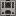

# Traitement des fluides

Les machines à fluides utilisent et/ou produisent des fluides. Chacune dispose d'un réservoir de fluides intégré (environ 16 seaux) plus des emplacements pour les cellules de fluides. La plupart consomment **1000 mB (1 seau)** de fluide par fabrication.

Voir [Fluides](./11%20Fluids) pour les détails sur l'UU-Matter, l'air comprimé et la source chaude.

## Laveuse de minerai

Lave les **minerais broyés** en **minerais purifiés** à l'aide d'eau. Machine de Niveau 1. Peut sortir vers 3 emplacements de sortie.

**Utilisation :** Fournissez de l'**eau** (via un tuyau à fluides, des cellules ou un seau) et insérez le minerai broyé. Consomme 1000 mB d'eau par fabrication.

### Recettes

| Entrée | Sortie principale | Sortie secondaire | Sortie tertiaire |
|--------|-------------------|-------------------|------------------|
| Cuivre broyé | Cuivre purifié | Petite poussière de cuivre | Poussière de pierre |
| Or broyé | Or purifié | Petite poussière d'or | Poussière de pierre |
| Fer broyé | Fer purifié | Petite poussière de fer | Poussière de pierre |
| Plomb broyé | Plomb purifié | Petite poussière de plomb | Poussière de pierre |
| Argent broyé | Argent purifié | Petite poussière d'argent | Poussière de pierre |
| Étain broyé | Étain purifié | Petite poussière d'étain | Poussière de pierre |
| Sacré broyé | Sacré purifié | — | Poussière de pierre |

## Réacteur de brassage

Une machine à recettes à deux entrées consommant des fluides qui brasse de puissantes potions. Machine de Niveau 1.

**Utilisation :** Placez une **fiole en verre** plus l'ingrédient requis, et fournissez de l'**eau** (1000 mB par fabrication). Certaines recettes utilisent un **Récipient vide** à la place.

<AdUnit />

### Recettes de potions (nécessitent une fiole en verre + de l'eau)

| Ingrédient | Potion produite |
|------------|-----------------|
| Patte de lapin | Super Saut (Saut amélioré IV) |
| Sucre | Super Rapidité (Vitesse IV) |
| Patte de lapin | Super Lenteur (Lenteur VI) |
| Carapace de tortue | Super Maîtrise de la tortue (Lenteur VIII + Résistance VI) |
| Œil d'araignée fermenté | Super Soin (Soin instantané IV) |
| Tranche de melon scintillante | Super Dégât (Dégât instantané IV) |
| Œil d'araignée | Super Poison (Poison IV) |
| Larme de ghast | Super Régénération (Régénération IV) |
| Poudre de blaze | Super Force (Force IV) |
| Tige de brise | Charge de vent |
| Toile d'araignée | Tissage |
| Bloc de slime | Suintement |
| Pierre | Infestation |

### Autres recettes

| Entrée 1 | Entrée 2 | Sortie |
|----------|----------|--------|
| Pierre sacrée impure | Récipient vide | Essence sacrée |

<AdUnit />

## Machine à café

Brasse des boissons au café avec de l'**eau**. Machine de Niveau 1.

**Utilisation :** Insérez les ingrédients et fournissez de l'eau (1000 mB par fabrication).

### Recettes

| Ingrédient(s) | Sortie | Effets |
|---------------|--------|--------|
| Grains de café | Americano | Vitesse II (120 s), Hâte I (60 s) |
| Seau de lait + Grains de café + Sucre | Cappuccino | Vitesse II (90 s), Régénération I (15 s) |
| Seau de lait + Grains de café | Latte | Vitesse I (60 s) |
| Grains de café + Fèves de cacao + Seau de lait | Mocha | Vitesse II (120 s), Régénération I (30 s) |
| Fèves de cacao | Chocolat chaud | Résistance I (20 s), Régénération I (30 s) |

## Générateur de matière

Produit le fluide **UU-Matter** à partir de l'énergie. Machine de Niveau 3.

**Utilisation :** Fournissez de l'énergie. La machine convertit **1 000 000 E par 1 mB** d'UU-Matter. Placer de la **Ferraille** dans l'emplacement d'entrée multiplie la production par **5×** (jusqu'à 5000 d'amplificateur de ferraille). L'UU-Matter peut être mis en bouteille dans des cellules.

## Réplicateur

Duplique n'importe quel objet qui a été scanné dans un **Cristal de stockage de motifs**. Machine de Niveau 4.

**Utilisation :**
1. Scannez d'abord un objet dans un **Cristal de stockage de motifs** (voir [Machines avancées](./06%20Advanced%20Machines)).
2. Insérez le cristal dans l'emplacement de cristal du Réplicateur.
3. Fournissez le **fluide UU-Matter** et l'énergie ; les deux sont consommés en continu jusqu'à ce que le coût en UU et le coût en énergie du motif soient atteints.
4. Trois modes sont disponibles : **STOP / SINGLE / LOOP** (basculer via le bouton de l'interface).

Les coûts de réplication par objet sont définis par la carte des valeurs du Réplicateur du mod (par ex. Caoutchouc 101 UU, Fragment d'iridium 13 UU, Plaque d'iridium 520 UU, Ferraille 1 UU).

<AdUnit />

