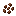

# Nourriture & Boissons

Le contenu alimentaire du mod tourne autour du **café**. Cultivez des grains de café, préparez des boissons au café et profitez d'effets temporaires.

## Grains de Café

Les grains de café sont une nourriture (1 nutrition, 0,1 saturation) et aussi un **objet de semence** pour la culture de café.

**Utilisation :** Faites un clic droit sur de la terre, de l'herbe, de la podzol, du sable ou des terres agricoles pour planter une culture de café. La culture pousse en 4 stades (`age` 0–3). Récolter une culture entièrement mûre donne **2–3 grains de café** (le stade 2 en donne 1–2).

### Croissance de la Culture de Café

La culture de café est un `CoffeeBlock` que vous plantez avec des grains de café. Elle mûrit avec le temps et peut être récoltée avec les grains.

<AdUnit />

## Boissons au Café

Toutes les boissons au café sont des **boissons** (animation de boisson), se cumulent à 1, sont toujours comestibles et placent un bloc de tasse décoratif à l'utilisation. Chacune confère des effets de statut uniques.

| Boisson | Nutrition / Sat. | Effets | Photo |
|---------|------------------|--------|-------|
| Américano (`coffee_black`) | 4 / 0,6 | Vitesse II (120 s), Hâte I (60 s) |
| Cappuccino | 9 / 1,2 | Vitesse II (90 s), Régénération I (15 s) |
| Latte | 7 / 1,0 | Vitesse I (60 s) |  |
| Mocha | 10 / 1,3 | Vitesse II (120 s), Régénération I (30 s) |
| Chocolat Chaud | 6 / 1,0 | Résistance I (20 s), Régénération I (30 s) |

## Faire du Café

Utilisez la **Machine à Café** (voir [Traitement des Fluides](./11%20Fluid%20Processing)) pour préparer des boissons. Chaque recette consomme 1000 mB d'eau.
> **Remarque :** voir la liste des recettes de la machine.

## Décorations du Distributeur

Le bloc du **Distributeur** affiche des objets alimentaires décoratifs sur ses étagères — sushis (saumon, œufs de morue, cuit), dango (sanshoku, anko), jus de fruits (chorus, baies sucrées, baies lumineuses) et lait. Ce ne sont que des **textures décoratives**, pas des objets récupérables dans le mod.

<AdUnit />

