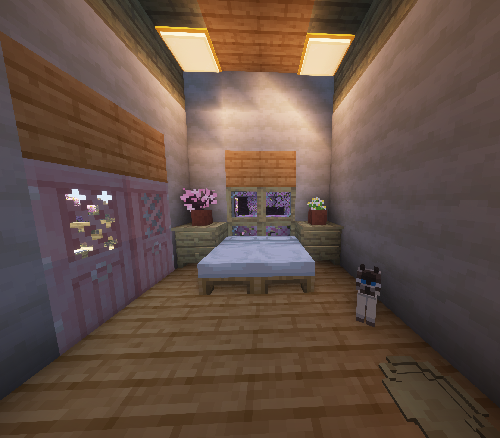
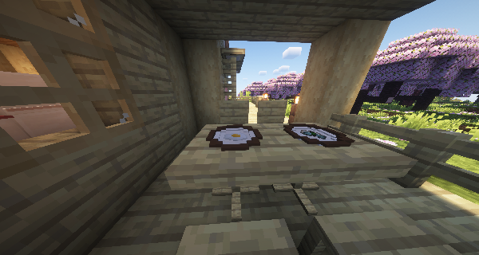
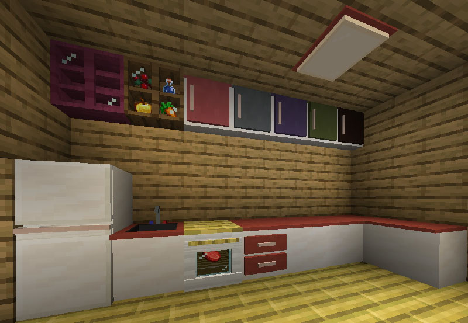

# Les Meubles de Skniro

#### **Le mod Skniro's Furniture introduit une large gamme de meubles tout en conservant l'esthétique originale de Minecraft.**

**Le mod Skniro's Furniture apporte une grande variété de meubles détaillés et esthétiquement cohérents à Minecraft, s'intégrant parfaitement au style vanilla original du jeu. Ce mod élargit considérablement vos options de construction créative et améliore l'immersion en offrant un riche ensemble d'objets fonctionnels et décoratifs.**

<iframe width="560" height="315" src="https://www.youtube-nocookie.com/embed/WO9gg1jR_vk" title="YouTube video player" frameborder="0" allow="accelerometer; autoplay; clipboard-write; encrypted-media; gyroscope; picture-in-picture; web-share" allowfullscreen></iframe>

Le mod propose un ensemble complet de meubles de cuisine, notamment des éviers, des comptoirs, des armoires, des fours et des réfrigérateurs, vous permettant de créer des cuisines réalistes. De plus, il fournit une large sélection de meubles de salon et de chambre tels que des canapés, des plafonniers, des meubles TV, des tables de chevet, des chaises, des fauteuils, des tables, des tables basses, ainsi que des objets plus spécialisés comme des armoires à 3 compartiments, des armoires à 4 compartiments, des bureaux, des bibliothèques, des fenêtres et des coussins de sol.

Les mises à jour récentes introduisent des **variantes en bois pour les tables**, des **tables en verre avec un stockage visible de 3×3 objets**, une collection croissante de variantes de **tableaux (Draw)**, ainsi qu'un **système de portes coulissantes fonctionnel** qui s'ouvre horizontalement et prend en charge plusieurs types de bois et de couleurs. Les options d'éclairage comme les **plafonniers et les lampes de bureau** peuvent être activées et désactivées pour une immersion accrue.

Ce qui rend ce mod encore plus polyvalent, c'est la variété de matériaux disponibles pour les meubles, comme le bois et l'argile, permettant aux joueurs de s'adapter à n'importe quel style architectural, du minimaliste moderne aux intérieurs rustiques ou vintage.

Le mod Skniro's Furniture accorde une grande attention aux détails des espaces de vie quotidiens, offrant à la fois fonctionnalité et beauté. C'est le choix parfait pour les constructeurs et les décorateurs qui souhaitent donner vie à leurs maisons dans Minecraft !

#### Pour plus d'informations détaillées, veuillez lire les contenus ci-dessous. MERCI !!!
<AdUnit />

