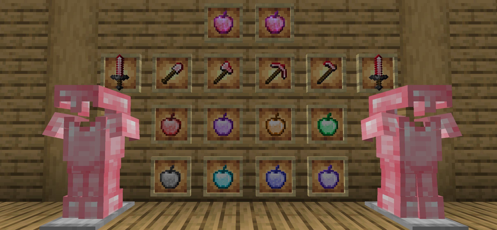
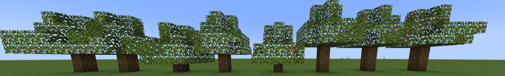

# Super Apple

#### Ce mod est une extension du contenu de l'édition originale, comme les pommes supplémentaires, le niveau des enchantements et le rubis.

#### Traduction
Vous pouvez soumettre des traductions pour Super Apple via notre page [Crowdin](https://crowdin.com/project/super-apple). N'hésitez pas à nous aider si vous parlez une langue ! Vous pouvez également soumettre des traductions via des pull requests.

#### Nouvelles pommes

Nous avons établi 9 pommes supplémentaires : pomme de hâte, pomme de force, pomme de vitesse, pomme de boost de santé, pomme de héros du village, pomme de résistance au feu, pomme de vision nocturne, pomme de saut amélioré, pomme suspecte et super pomme.
La pomme suspecte (Fabric uniquement) fonctionne comme la soupe suspecte, mais elle est facile à fabriquer. Elle n'utilise qu'une pomme et une fleur. (2.1.0+)

La Super Apple peut donner au joueur un bonus de 1 à 5 minutes comme hâte, boost de santé, saut amélioré, vitesse, force et résistance.

#### Nouveau minerai (Minecraft 1.16+ uniquement)

Nous ajoutons le rubis, qui est le matériau principal de la super pomme.

Le rubis est utilisé pour composer la pomme de hâte et la super pomme.

#### Nouvel enchantement (1.3.8+)
Nous augmentons la limite maximale des niveaux d'enchantement. Cela vous permet d'avoir une meilleure sensation lorsque vous jouez.

#### Nouvelle armure et nouveaux outils (2.2.0+)
L'armure et les outils en rubis possèdent une résistance et une durabilité entre le diamant et la Netherite. Les performances d'enchantement sont meilleures que l'or. Ils prennent également en charge le modèle de forge. (Minecraft 1.20+ et Super Apple 2.3.0+).

#### Nouvel arbre (3.0.0+)
Ajout des arbres fruitiers des pommes à effet (pas de Super Apple Tree), les pousses ne nécessitent qu'être composées de pousses de chêne et de n'importe quelle pomme à effet, et les feuilles fruitières ne disparaîtront pas après que les fruits mûrs ont été cueillis.

<AdUnit />

