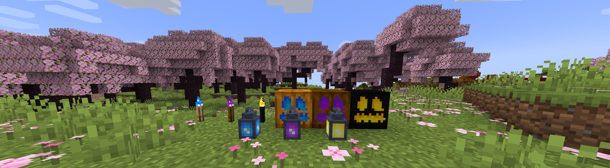
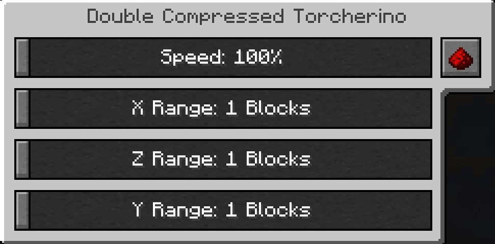

# Torcherino (Non officiel)

*Torcherino* est un mod Minecraft simple mais puissant qui introduit une torche spéciale accélérant la vitesse des ticks aléatoires des blocs voisins. Cela signifie que les cultures poussent plus vite, que les pousses mûrissent plus rapidement et que l'herbe se propage rapidement — tout cela sans modifier les réglages globaux des ticks de votre monde !

*C'est une publication non officielle de Torcherino. Je porterai Torcherino vers des versions plus récentes de Minecraft avant que l'update officielle ne le fasse.*

### Fonctionnalités :

- Ajoute une torche unique qui augmente le taux de ticks aléatoires dans un rayon configurable
- Accélère la croissance des cultures, des arbres, la propagation de l'herbe, la décomposition des feuilles, et plus encore
- Portée et multiplicateur de vitesse des ticks configurables via les fichiers de configuration du mod
- Compatible avec le vanilla et de nombreux blocs et cultures moddés
- Performant et facile à utiliser !

Faire pousser les plantes plus vite, fondre les minerais plus rapidement, augmenter la vitesse des spawners. Il y a un Torcherino principal, puis diverses améliorations qui s'y ajoutent. Beaucoup de ces éléments sont configurables dans le fichier de configuration du mod, appelé Torcherino.cfg et situé dans le dossier config/sci4me.

Après avoir placé un Torcherino, il est désactivé par défaut. Vous devez faire un clic droit dessus et utiliser l'interface pour ajuster ses réglages à la portée et à la vitesse que vous préférez.

N'hésitez pas à ajouter Torcherino à vos modpacks ! Bien sûr, les crédits sont appréciés !

#### Note importante : Ce mod a été créé à l'origine par Moze_Intel. Après qu'il a décidé d'arrêter de le maintenir, j'ai repris le flambeau. Donc, beaucoup de crédits à lui aussi ! :)

##### Anciens mainteneurs

##### Moze_Intel

##### sci4me

##### 3llemes

##### Mainteneurs actuels

##### lukegrahamlandry

##### Mainteneur non officiel

##### skniro
<AdUnit />

