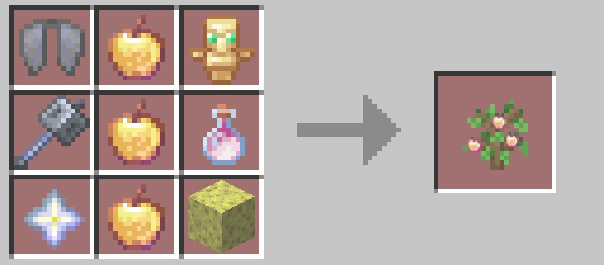
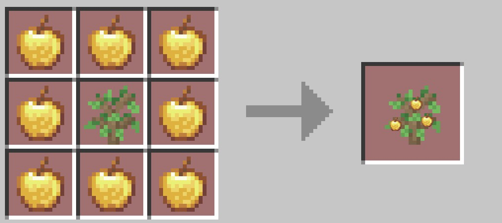
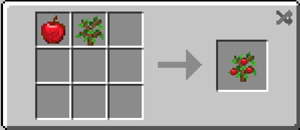
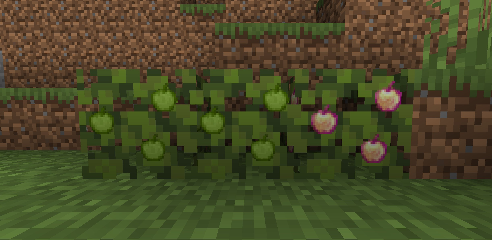

# Golden Apple Tree

#### This mod add two apple tree, it can help you grow golden apple and enchanted golden apple.

#### Sapling Recipe

## Growth of the Golden Apple Tree

The growth of the Golden Apple Tree is divided into three stages. During the first two stages, no visible changes occur. In the third stage, the fruit matures, and you can harvest it by right-clicking on the ripe fruit.
<AdUnit />

