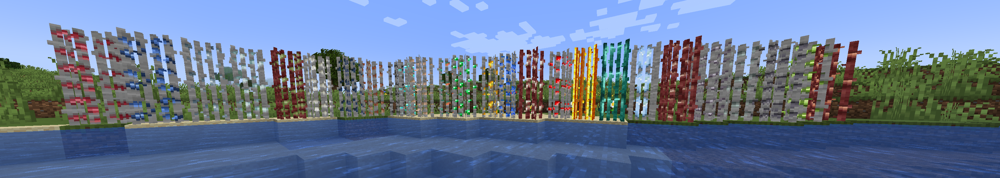
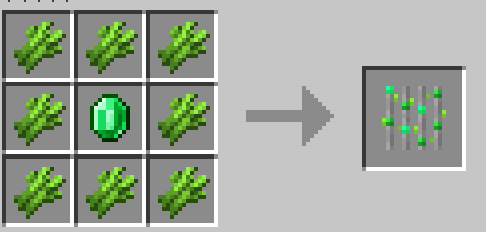
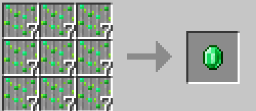
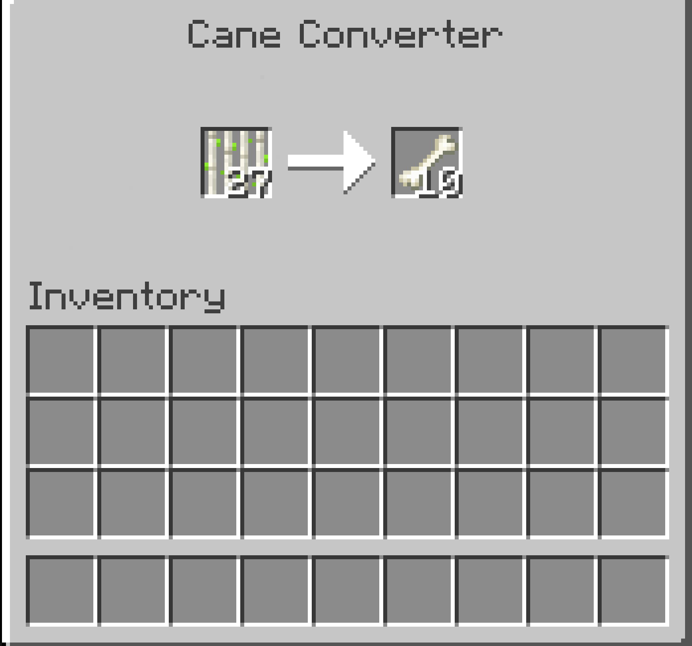

# Growable Ores

GrowableOres Mod is a modification that contains a good amount of content to help to farm ores.

## Translation
Submitting translations for GrowableOres can be done via our [Crowdin](https://crowdin.com/project/growable-ore) page. Consider helping us out if you're fluent in any language at all! Alternatively, translations can still be submitted via pull requests.

## This mod supports:
Applied Energistcs 2!  
TechReborn!  
BetterEnd!  
Powah Rearchitected!(Mod Version Fabric 1.3.0+, Forge1.1.0+)  
Modern Industrialization!(Mod Version Fabric 1.4.0+)  
Industrial Revolution!(Mod Version Fabric 1.4.1+)  
Thermal Series!(Mod Version Forge 1.2.0+)  
Create!(Mod Version Fabric 1.6.0+ , Forge 1.2.0+)  
IC2 Classic!(Mod Version Fabric 1.6.0+ , Forge 1.3.0+)  
Ad Astra!(Mod Version Fabric 1.6.0+ , Forge 1.2.0+)  
Super Apple!  
Maple!  
BotanyPots!(Mod Version Fabric 1.8.0+ or 1.7.0+(1.20.1), Forge 1.6.0+, Neoforge 1.6.0+)  
Mekanism!(Mod Version 2.4.0+)  
BetterNether!(Mod Version 2.4.0+)  
Energized Power!(Mod Version 2.4.0+)

Mod Version 3.0.0+  
Biomes O' Plenty!
Draconic Evolution !  
Extreme Reactors !  
Galosphere！  
Gobber2！  
GregTechCEu Modern!  
Mana and Artifice!   
Mystical Agradditions!   
MysticalAgriculture!  
Railcraft！  
RFTools！  
Tinkers' Construct！

## Features and Functionality

GrowableOres Mod basically implements specialized sugar cane crops that, instead of growing traditional sugar cane, actually grow the ores that you’d usually have to mine by going through a great deal of effort. Thanks to this mod, you’ll basically be able to farm your ores like you do traditional crops and this is going to allow you to acquire all the ores you need in an extremely convenient way. The mod has ore canes for pretty much every Minecraft ore you’d ever need ranging from coal to diamond and, as long as you use it properly, it’s sure to fulfill quite a few of your ore needs.

Mod Version 3.0.0 or 2.5.0+  
Add a tag to custom based growing block and fluid.  
Config Ore cane height.  
Plant Ore Cane by the lava lake.  
Enable Bone meal accelerate ore canes grow on config.

## Recipes

You can check recipes in REI or JEI mod.

A simple:  

If you want got ore use less cane your can choice [GrowableOres Extension(Curseforge Link)](https://www.curseforge.com/minecraft/mc-mods/growableores-extension)) mod it can help your one cane to one ore.

<AdUnit />
