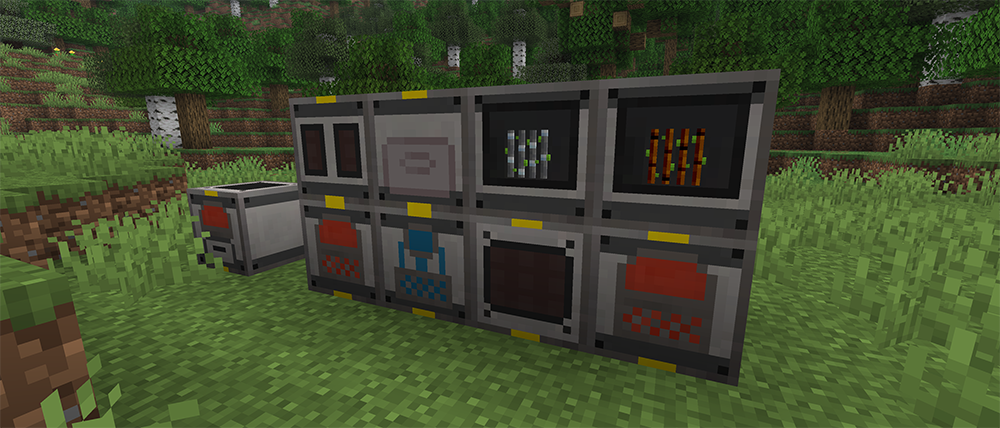
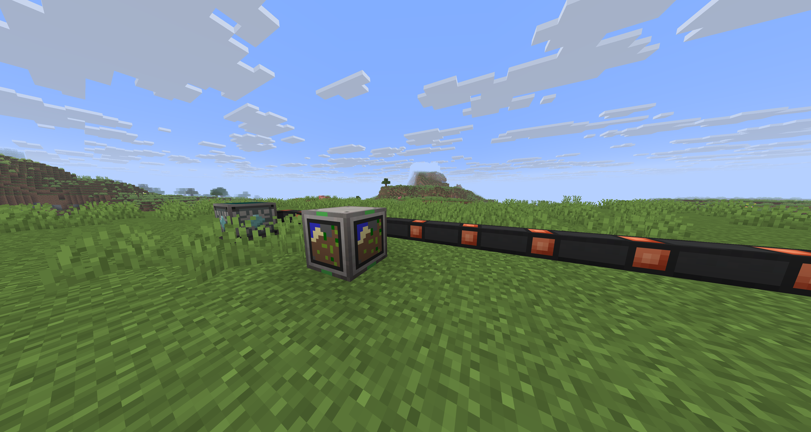
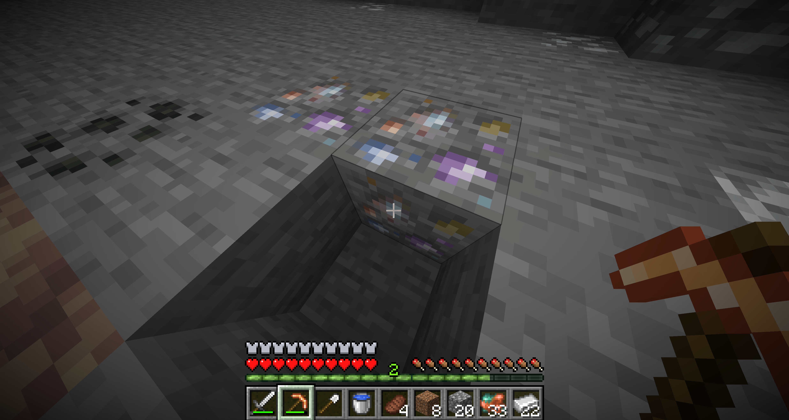

# Skniro's Industrial Elixir

Welcome to *Industrial Elixir* — a world where industry and nature come together in harmony.  
*Industrial Elixir* is a technology and automation mod designed around gradual progression and discovery. Instead of overwhelming you with complex systems from the beginning, it lets you grow step by step: start with basic tools, build your first machines, and slowly expand a small workshop into a powerful industrial network.
Crush ores, refine materials, shape components, and watch your very first production line come to life. Every machine you build is a small step toward creating something greater.
  
  

## What is it?

*Industrial Elixir* is a Minecraft tech mod focused on machinery, automation, energy, and resource processing, while keeping a relaxing and approachable progression.

- **A smooth industrial journey** — Begin with simple machines such as the Macerator and Compressor, then advance toward electric furnaces, induction furnaces, metal formers, and more advanced technology.
- **Build your own energy network** — Generate power through coal, fluids, sunlight, wind, and other sources. Connect machines, manage energy, and create a system that fits your own factory.
- **Resources that grow** — Mining isn't the only way to obtain materials. Cultivate special ores like crops, harvest rubber trees, and create renewable resource systems.
- **Industry with comfort** — Grow coffee beans, brew drinks, and relax in hot springs. A factory can be productive while still feeling like home.
- **Advanced technology awaits** — When you are ready, explore powerful systems such as reactors, replication technology, and quantum-level equipment.  
  
    
  

## Why you might like it

- A complete material processing journey: crush, refine, purify, and transform resources into advanced components.
- Flexible energy production and storage systems for factories of all sizes.
- Item and fluid transportation networks using pipes and automation.
- Renewable resources through growable ores, rubber trees, and agricultural systems.
- With JEI / REI support for convenient recipe viewing.

Whether you are a newcomer to technology mods or an experienced player, *Industrial Elixir* invites you to create, experiment, and build your own industrial world.

## Contents

| Guide | Description |
|---|---|
| [Energy System](./02%20Energy%20System) | Cables, batteries, storage boxes, charge pads, transformers, pipes |
| [Power Generation](./03%20Power%20Generation) | Coal, fluid, solar, wind generators |
| [Processing Machines](./04%20Processing%20Machines) | Macerator, compressor, metal former, furnaces and more |
| [Advanced Machines](./06%20Advanced%20Machines) | Molecular transformer, pattern storage, crop farm, vendor machine |
| [Heat & Reactors](./07%20Heat%20and%20Reactors) | Heaters, blast furnace, nuclear reactor, sacred reactor |
| [Items & Materials](./08%20Items%20and%20Materials) | Every item and what it does |
| [Equipment](./09%20Equipment) | Bronze & quantum armor, tools, jetpack |
| [Fluids](./10%20Fluids) | UU-Matter, compressed air, hot spring |
| [Fluid Processing](./11%20Fluid%20Processing) | Ore washing, brew reactor, coffee machine, replicator, matter generator |
| [World Generation](./12%20World%20Generation) | Ores, rubber tree, structures, loot tables |
| [Food](./13%20Food) | Coffee beans and coffee drinks |
| [Crafting Recipes](./14%20Crafting%20Recipes) | All crafting-table recipes |

<AdUnit />

