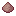
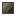
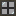
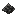
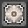
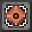

# Items & Materials

This page catalogs every item in Industrial Elixir and what it is used for.

## Batteries

Batteries store energy and are charged in generators, energy boxes, and charge pads.

| Item | Capacity | Tier | Use | Photo |
|------|----------|------|-----|-------|
| RE Battery | 10,000 E | Tier 1 | Entry battery |  |
| Advanced RE Battery | 100,000 E | Tier 2 | Mid-tier battery |  |
| Energy Crystal | 1,000,000 E | Tier 3 | High-tier battery |  |
| Lapotron Crystal | 10,000,000 E | Tier 4 | Top rechargeable battery |  |

## Upgrade Modules

Install these in the 4 upgrade slots of machines.

| Item | Effect | Photo |
|------|--------|-------|
| Overclocker Upgrade | Speed −30%, power +60% |  |
| Energy Storage Upgrade | +10,000 E storage |  |
| Transformer Upgrade | Energy tier +1 |  |
| Redstone Inverter Upgrade | Invert redstone signal |  |

## Hand Tools

| Item | Use | Photo |
|------|-----|-------|
| Hammer | Rolling operation (durability 80) |  |
| Cutter | Cutting operation (durability 80) |  |

The Hammer and Cutter mirror the Metal Former's rolling/cutting recipes on a crafting table. They leave a damaged remainder when used in crafting.

## Armor & Equipment

### Bronze Set

| Item | Defense | Photo |
|------|---------|-------|
| Bronze Helmet | 2 |  |
| Bronze Chestplate | 6 |  |
| Bronze Leggings | 5 |  |
| Bronze Boots | 2 |  |

### Bronze Tools

| Item | Notes | Photo |
|------|-------|-------|
| Bronze Sword | 3.0 damage |  |
| Bronze Shovel | 1.5 damage |  |
| Bronze Pickaxe | 1.0 damage |  |
| Bronze Axe | 6.0 damage |  |
| Bronze Hoe | — |  |

### Quantum Armor (Powered)

Each piece stores **10,000,000 E**, Tier 5. Full-featured IC2-style powered armor.

| Item | Ability | Photo |
|------|---------|-------|
| Quantum Helmet | Underwater air refill, hunger refill, removes Poison/Wither, toggleable Night Vision |  |
| Quantum Chestplate | Jetpack flight & hover, clears fire |  |
| Quantum Leggings | Sprint speed ×3 (×9 on ice), Dolphin's Grace |  |
| Quantum Boots | Boosted jump, negates fall damage |  |

Wearing the full set absorbs damage using energy, reducing damage per piece.

### Electric Jetpack

| Item | Notes | Photo |
|------|-------|-------|
| Electric Jetpack | Chestplate, 300,000 E, Tier 3. Flight & hover, clears fire |  |

### Rubber Boats & Signs

| Item | Use | Photo |
|------|-----|-------|
| Rubber Sign | Placeable sign |  |
| Rubber Hanging Sign | Hanging sign |  |
| Rubber Boat | Boat |  |
| Rubber Chest Boat | Boat with chest |  |

## Food & Drinks

| Item | Nutrition / Sat | Effects | Photo |
|------|-----------------|---------|-------|
| Coffee Bean | 1 / 0.1 | Plantable seed |  |
| Americano | 4 / 0.6 | Speed II (120s), Haste I (60s) |  |
| Cappuccino | 9 / 1.2 | Speed II (90s), Regeneration I (15s) |  |
| Latte | 7 / 1.0 | Speed I (60s) |  |
| Mocha | 10 / 1.3 | Speed II (120s), Regeneration I (30s) |  |
| Hot Cocoa | 6 / 1.0 | Resistance I (20s), Regeneration I (30s) |  |

## Fluids, Buckets & Cells

| Item | Fluid | Use | Photo |
|------|-------|-----|-------|
| UU Matter Bucket | UU-Matter | Place/store UU-Matter |  |
| Compressed Air Bucket | Compressed Air | Used by Blast Furnace |  |
| Hot Spring Bucket | Hot Spring | Place/store hot spring water |  |
| Empty Cell | — | Empty fluid cell |  |
| Water Cell | Water | Water fluid cell |  |
| Lava Cell | Lava | Lava fluid cell |  |
| UU Matter Cell | UU-Matter | UU-Matter fluid cell |  |
| Air Cell | Compressed Air | Air fluid cell |  |
| Hot Spring Cell | Hot Spring | Hot spring fluid cell |  |

## Ores & Processing Intermediates

### Raw Ores

| Item | Photo | | Item | Photo |
|------|-------|---|---|-------|
| Raw Lead |  | | Raw Tin |  |
| Raw Sacred |  | | | |

### Crushed Ores (Macerator output)

| Item | Photo | | Item | Photo |
|------|-------|---|---|-------|
| Crushed Copper |  | | Crushed Gold |  |
| Crushed Iron |  | | Crushed Lead |  |
| Crushed Silver |  | | Crushed Tin |  |
| Crushed Sacred |  | | | |

### Purified Ores (Ore Washing output)

| Item | Photo | | Item | Photo |
|------|-------|---|---|-------|
| Purified Copper |  | | Purified Gold |  |
| Purified Iron |  | | Purified Lead |  |
| Purified Silver |  | | Purified Tin |  |
| Purified Sacred |  | | | |

## Dusts

### Full Dusts

| Item | Photo | | Item | Photo |
|------|-------|---|---|-------|
| Bronze Dust |  | | Lithium Dust |  |
| Clay Dust |  | | Obsidian Dust |  |
| Coal Dust |  | | Silicon Dioxide Dust |  |
| Copper Dust |  | | Silver Dust |  |
| Diamond Dust |  | | Stone Dust |  |
| Energium Dust |  | | Sulfur Dust |  |
| Gold Dust |  | | Tin Dust |  |
| Iron Dust |  | | Lapis Dust |  |
| Lead Dust |  | | | |

### Small Dusts

Nine small dusts combine into one full dust (see [Crafting Recipes](./09%20Crafting%20Recipes)).

| Item | Photo | | Item | Photo |
|------|-------|---|---|-------|
| Small Bronze Dust |  | | Small Silver Dust |  |
| Small Copper Dust |  | | Small Sulfur Dust |  |
| Small Gold Dust |  | | Small Tin Dust |  |
| Small Iron Dust |  | | Small Lapis Dust |  |
| Small Lead Dust |  | | Small Lithium Dust |  |
| Small Obsidian Dust |  | | | |

## Ingots, Plates, Dense Plates & Casings

### Ingots

| Item | Photo | | Item | Photo |
|------|-------|---|---|-------|
| Bronze Ingot |  | | Steel Ingot |  |
| Lead Ingot |  | | Tin Ingot |  |
| Silver Ingot |  | | Sacred Ingot |  |
| Alloy Ingot |  | | Iridium Ingot |  |

### Plates

| Item | Photo | | Item | Photo |
|------|-------|---|---|-------|
| Bronze Plate |  | | Obsidian Plate |  |
| Copper Plate |  | | Steel Plate |  |
| Gold Plate |  | | Tin Plate |  |
| Iron Plate |  | | Alloy Plate |  |
| Lapis Plate |  | | Iridium Plate |  |
| Lead Plate |  | | | |

### Dense Plates

| Item | Photo | | Item | Photo |
|------|-------|---|---|-------|
| Dense Bronze Plate |  | | Dense Obsidian Plate |  |
| Dense Copper Plate |  | | Dense Steel Plate |  |
| Dense Gold Plate |  | | Dense Tin Plate |  |
| Dense Iron Plate |  | | Dense Lapis Plate |  |
| Dense Lead Plate |  | | | |

### Casings

| Item | Photo | | Item | Photo |
|------|-------|---|---|-------|
| Bronze Casing |  | | Lead Casing |  |
| Copper Casing |  | | Steel Casing |  |
| Gold Casing |  | | Tin Casing |  |
| Iron Casing |  | | | |

## Carbon, Coal & Diamond Products

| Item | Use | Photo |
|------|-----|-------|
| Carbon Fibre | Carbon line precursor |  |
| Carbon Mesh | Carbon line precursor |  |
| Carbon Plate | Carbon line product |  |
| Coal Ball | Compressed coal product |  |
| Coal Chunk | Coal compression product |  |
| Industrial Diamond | Crafted industrial diamond |  |

## Iridium, Alloy & Advanced Materials

| Item | Use | Photo |
|------|-----|-------|
| Iridium Shard | Combine into Iridium Ore |  |
| Iridium Ore | Smelt/compress into Iridium Ingot |  |
| Alloy Ingot | Alloy crafting material |  |
| Alloy Plate | Machine/upgrade crafting |  |

### Endgame Materials

| Item | Use | Photo |
|------|-----|-------|
| Irradiant Sacred | Advanced alloy ingredient |  |
| Irradiant Glass Pane | Advanced crafting |  |
| Luminite | Combine 9 Luminite Components |  |
| Enriched Luminite | Advanced alloy ingredient |  |
| Luminite Alloy | Advanced alloy |  |
| Enriched Luminite Alloy | Advanced alloy |  |
| Iridium Amethyst Plate | Advanced plate |  |
| Reinforced Iridium Amethyst Plate | Advanced plate |  |
| Irradiant Reinforced Plate | Solar panel crafting |  |
| Luminite Component | Molecular Transformer output |  |
| Quantum Core | Quantum solar panel crafting |  |
| Molecular Transformer Core | Molecular Transformer crafting |  |

## Circuits & Electrical Components

| Item | Use | Photo |
|------|-----|-------|
| Circuit | Basic electronic circuit |  |
| Advanced Circuit | Advanced circuit |  |
| Coil | Machine component (Electric Heater fuel) |  |
| Electric Motor | Machine component |  |
| Heat Conductor | Heat-transfer component |  |

## Rubber & Resin

| Item | Use | Photo |
|------|-----|-------|
| Sticky Resin | Extract into Rubber |  |
| Rubber | Insulation, cables, crafting |  |

## Scrap & Scrap Box

| Item | Use | Photo |
|------|-----|-------|
| Scrap | Fuel (900 ticks) and Matter Generator amplifier |  |
| Scrap Box | Right-click to open for a random reward |  |

## Misc Materials

| Item | Use | Photo |
|------|-----|-------|
| Empty Vessel | Brew Reactor / Blast Furnace intermediate |  |
| Impure Sacred Stone | Processed into Sacred Essence |  |
| Slag | Blast Furnace byproduct |  |
| Ashes | Solid Fuel Heater byproduct |  |
| Pattern Storage Crystal | Stores scanned item patterns |  |
| Raw Pattern Storage Crystal | Blank crystal for scanning |  |
| Pipe Plug | Block a face on a pipe | (crafted) |

<AdUnit />

