# World Generation

Industrial Elixir adds three new ores, a rubber tree, and a hot-spring structure to the Overworld.

## Ores

The mod adds **Tin**, **Lead**, and **Sacred** ores to the Overworld. Each has a stone variant (in the upper layers) and a deepslate variant (in the deep layers). All ores drop their raw material with Silk Touch / Fortune and grant **2–4 XP** when mined.

| Ore | Stone Variant | Deepslate Variant | Veins/Chunk | Vein Size | Height Range |
|-----|---------------|-------------------|-------------|-----------|--------------|
| Tin | 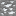 Tin Ore | 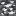 Deepslate Tin Ore | 10 / 12 | 10 | 0–40 / −64–0 |
| Lead | 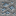 Lead Ore | 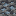 Deepslate Lead Ore | 8 / 10 | 8 | 0–63 / −64–0 |
| Sacred |  Sacred Ore |  Deepslate Sacred Ore | 6 / 8 | 6 | 0–64 / −64–0 |

- The **stone** variants only replace regular stone.
- The **deepslate** variants replace deepslate and other deepslate-ore-replaceable blocks.

### Raw Ore Blocks

Raw ores can be compressed into raw metal blocks for compact storage:

| Block | Photo | | Block | Photo |
|-------|-------|---|---|-------|
| Raw Tin Block |  | | Raw Lead Block | 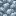 |
| Raw Sacred Block |  | | | |

## Rubber Tree

Rubber trees generate naturally in **forest** biomes. They are the source of **Sticky Resin**, which is extracted into **Rubber**.

| Block | Photo |
|-------|-------|
| Rubber Log | 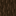 |
| Rubber Leaves |  |
| Rubber Sapling | 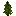 |

**Growth:** Rubber trees are 4–6 blocks tall with a blob-shaped canopy. Each tree has **1–2 sap logs** (`rubber_rubber_log`) embedded in the trunk that are fully grown when the tree spawns.

### Harvesting Rubber Sap

The **sap log** is a special crop-like log that grows in three stages (0 → 1 → 2). It matures over time (random tick, needs light level ≥ 9) or can be accelerated with bone meal.

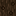 →  → 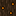

**Usage:** Right-click a fully grown (stage 2) sap log to harvest **1 Sticky Resin**. This resets the log back to stage 0, and it will regrow.

## Hot Spring Baths Structure

The mod generates a single structure: **`industrial_elixir_hot_spring_baths`** — a hot-spring bath house made mostly of rubber wood and deepslate tile.
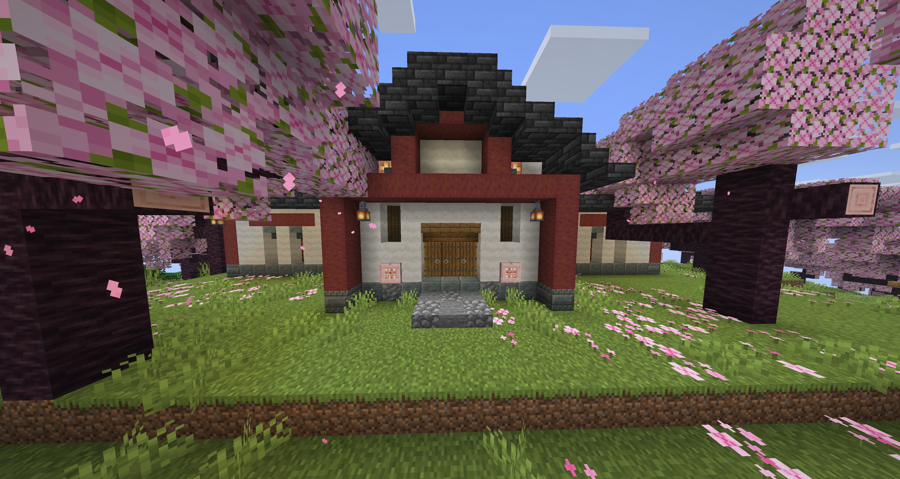
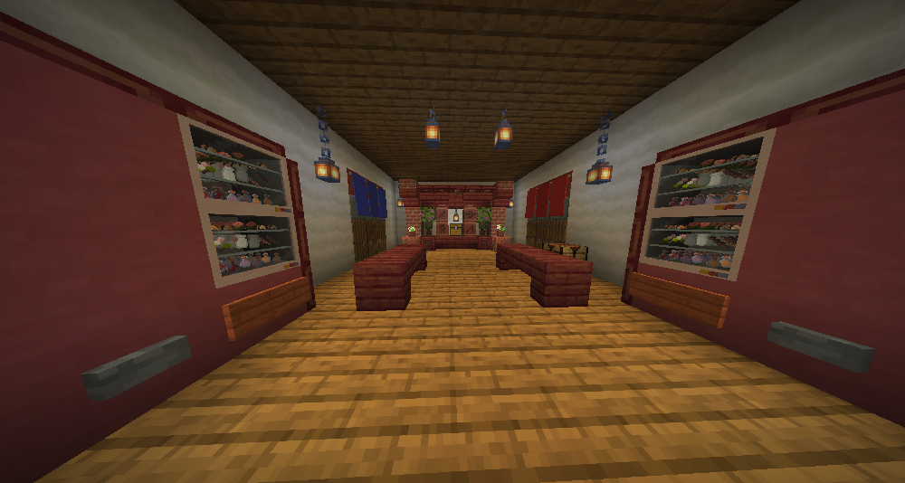
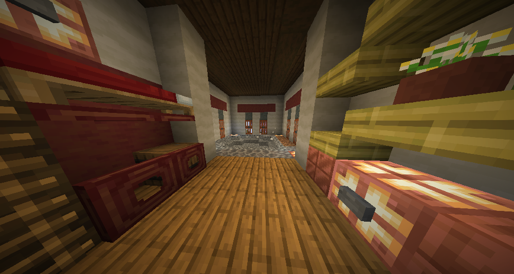

**Where it generates:**
- Biome: **Cherry Grove** (in the Overworld)
- Placement: random spread, spacing 34 chunks, separation 8

**What's inside:**
- A 19×12×40 building built from rubber planks/stairs, cobblestone stairs (with hot-spring logging), and deepslate tile.
- Hot Spring fluid blocks scattered around the baths.
- **4 Vendor Machines** (lit) — these act as villager-style merchants selling many mod items for emeralds.
- Beds, a crafting table, note blocks, flower pots, lanterns, and decorative food items on the vendor shelves.

**Note:** The chests/barrels inside the structure generate empty; the real loot comes from the Vendor Machines' random trades.

## Loot Tables

Industrial Elixir adds mod items to **many vanilla chest loot tables**. Every affected chest gets up to 4 extra loot pools, each with a chance to contain one random item.

### Loot Pool Contents

| Pool | Items (1 random pick) |
|------|-----------------------|
| Bronze Armor | Bronze Helmet, Bronze Chestplate, Bronze Leggings, Bronze Boots |
| Dusts | Bronze/Clay/Coal/Copper/Diamond/Energium/Gold/Iron/Lapis/Lead/Lithium/Obsidian/Silicon Dioxide/Silver/Stone/Sulfur/Tin Dust |
| Iridium Ore | Iridium Ore |
| Iridium Shard | Iridium Shard |

### Chest Chances

| Chest | Armor | Dust | Iridium Ore | Iridium Shard |
|-------|-------|------|-------------|---------------|
| Ancient City | 35% | 55% | 10% | 5% |
| Bastion Treasure | 35% | 55% | 10% | 5% |
| End City Treasure | 35% | 55% | 10% | 5% |
| Bastion Bridge | 20% | 35% | 6% | 3% |
| Bastion Other | 20% | 35% | 6% | 3% |
| Woodland Mansion | 25% | 35% | 6% | 3% |
| Nether Bridge | 20% | 35% | 6% | 3% |
| Bastion Hoglin Stable | 18% | 30% | 5% | 2% |
| Stronghold Corridor | 18% | 30% | 5% | 2% |
| Stronghold Crossing | 18% | 30% | 5% | 2% |
| Desert Pyramid | 12% | 25% | 4% | 2% |
| Jungle Temple | 12% | 25% | 4% | 2% |
| Jungle Temple Dispenser | 12% | 25% | 4% | 2% |
| Pillager Outpost | 12% | 25% | 4% | 2% |
| Ruined Portal | 12% | 25% | 4% | 2% |
| Simple Dungeon | 12% | 25% | 4% | 2% |
| Igloo Chest | 8% | 18% | 3% | 1% |
| Abandoned Mineshaft | 8% | 18% | 3% | 1% |
| Buried Treasure | 8% | 18% | 3% | 1% |
| Underwater Ruin (Small) | 8% | 18% | 3% | 1% |
| Underwater Ruin (Big) | 8% | 18% | 3% | 1% |
| Shipwreck Map | 8% | 18% | 3% | 1% |
| Shipwreck Supply | 8% | 18% | 3% | 1% |
| Shipwreck Treasure | 8% | 18% | 3% | 1% |

<AdUnit />

