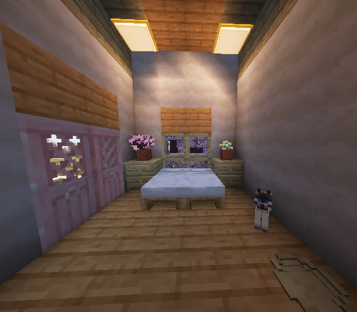
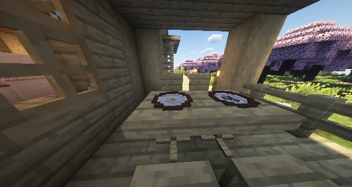
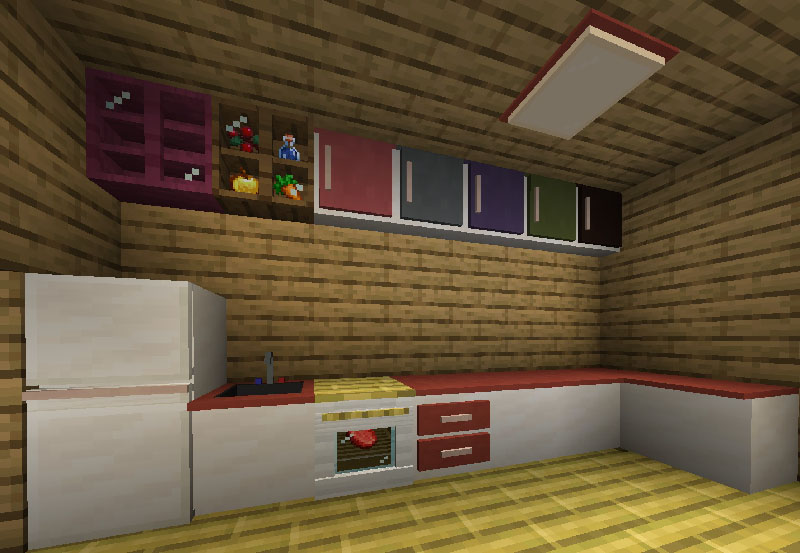

# Skniro's furniture

#### **Skniro's furniture mod introduces a wide range of furniture while keeping the original Minecraft aesthetic.**

**Skniro’s Furniture Mod brings a wide variety of detailed and aesthetically consistent furniture to Minecraft, seamlessly blending into the game’s original vanilla style. This mod greatly expands your creative building options and enhances immersion by offering a rich set of functional and decorative items.** 

<iframe width="560" height="315" src="https://www.youtube-nocookie.com/embed/WO9gg1jR_vk" title="YouTube video player" frameborder="0" allow="accelerometer; autoplay; clipboard-write; encrypted-media; gyroscope; picture-in-picture; web-share" allowfullscreen></iframe>  

The mod features a complete kitchen furniture set, including sinks, counters, cabinets, ovens, and refrigerators, allowing you to create realistic kitchen spaces. In addition, it provides a large selection of living room and bedroom furniture such as sofas, ceiling lights, TV stands, nightstands, chairs, coffee chairs, tables, coffee tables, as well as more specialized items like 3-slot cabinets, 4-slot cabinets, desks, bookshelves, windows, and floor cushions.

  
  

What makes this mod even more versatile is the variety of material variants available for the furniture, such as wood and clay, allowing players to match any architectural style—from modern minimalist to rustic or vintage interiors.
   
Skniro’s Furniture Mod pays close attention to the details of everyday living spaces, offering both functionality and beauty. It's the perfect choice for builders and decorators looking to bring their homes to life in Minecraft!

#### For the detailed information, please read the minute contents below. THANKS!!!
<AdUnit />
