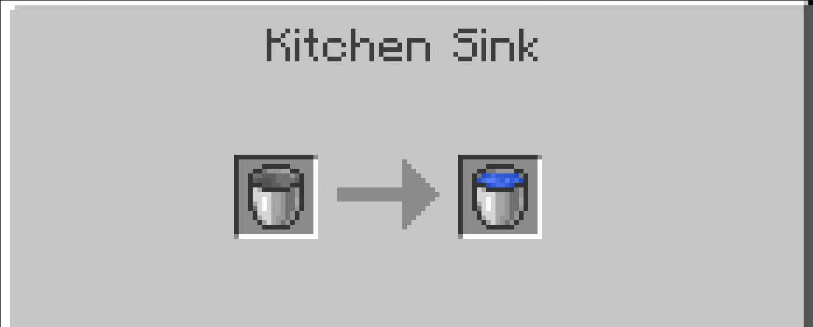

# Function

### Oven

The oven uses the same recipes as the vanilla smoker block.

### Plate

You can right-click to place items onto the plate and take them off.

### Kitchen Sink

You can place a bucket into the sink, and it will automatically be filled with water.

### Cabinet

You can place items into the Cabinet just like a vanilla chest. The Four Grid Cabinet and Triple Cabinet will display the items stored inside.

### **Ceiling Lamp**

The Ceiling Lamp can be turned on and off with a right-click — a simple light source.

### Chair/Sofa/Coffee Chair/Cushion

Right-click to sit on the Chair, Sofa, Coffee Chair, or Cushion, and press Shift to stand up.

