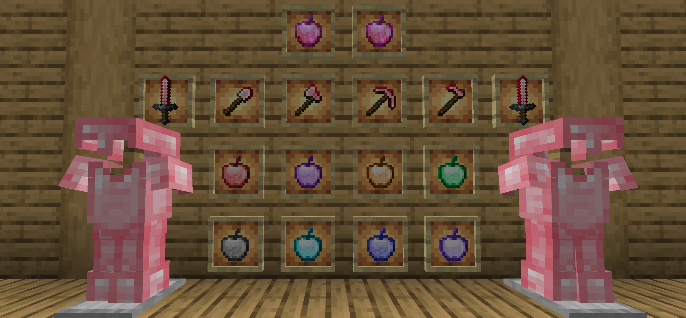
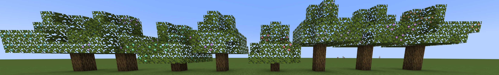

# Super Apple

#### This mod is the extend contents of the original edition contents, such as the extra apples, the level of the enchantments, and ruby.

#### Translation
Submitting translations for Super Apple can be done via our [Crowdin](https://crowdin.com/project/super-apple) page. Consider helping us out if you're fluent in any language at all! Alternatively, translations can still be submitted via pull requests.  

#### New Apples

We establish 9 extra apples, respectively are haste apple, strength apple, speed apple, health boost apple, village hero apple, fire resistance apple, night vision apple, jump boost apple, suspicious apple and super apple.
Suspicious apple(fabric only) same like suspicious stew,but it is easy to crafting. It only use a apple and a flower.(2.1.0+)

Super Apple can give player 1-5 minutes buff like haste,health_boost,jump_boost,speed,strength and resistance.

#### New Ore(Only Minecraft 1.16+)

We add the ruby, which is the main material of the super apple.

Ruby use to compound Haste Apple and Super Apple.

#### New enchantment(1.3.8+)
We upgrade the up line of the enchantment levels. By doing that, you might have the better felling when you playing.

#### New Armour and tools(2.2.0+)
Ruby Armour and tools strenstrength and durability between diamond and Netherite.The enchantment performance better than gold. It's also support smithing template.(Minecraft1.20+ And Super Apple 2.3.0+).

#### New tree(3.0.0+)
Adding effect apples's fruit tree(No Super Apple Tree), the saplings only need to be composed of oak saplings and any effect apple, and the fruiting leaves will not disappear after the mature fruits has been picked.

<AdUnit />
