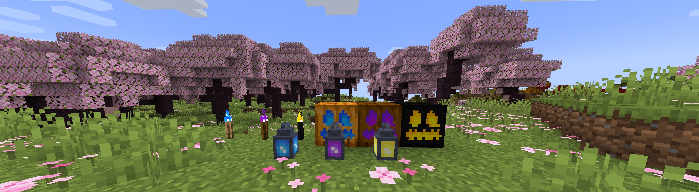
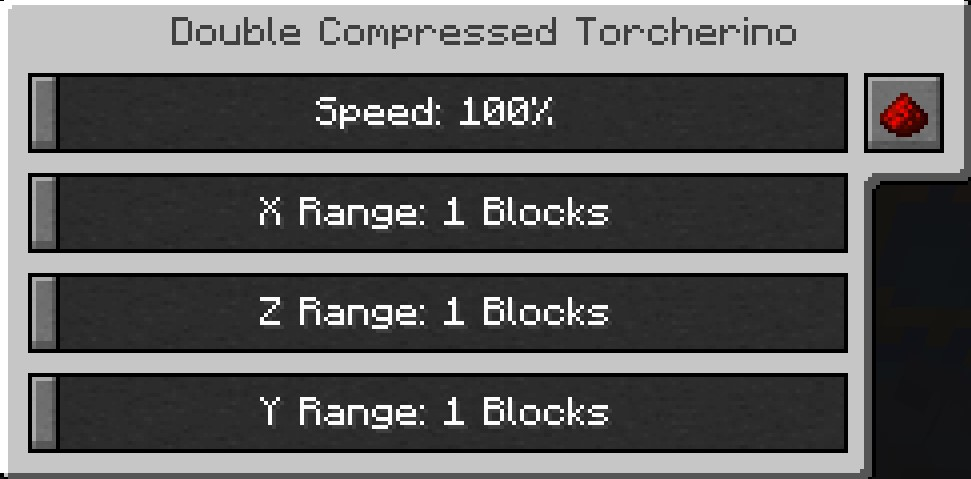

# Torcherino Unofficial

 *Torcherino* is a simple yet powerful Minecraft mod that introduces a special torch which accelerates the random tick speed of nearby blocks. This means crops grow faster, saplings mature quicker and grass spreads rapidly — all without changing your world’s global tick settings!

*It is a unofficial torcherino publish,I will port torcherino to higher minecraft version before official update it to higher version.*

### Features:

- Adds a unique torch that boosts random tick rate in a configurable radius
- Speeds up crop growth, tree growth, grass spreading, leaf decay, and more
- Configurable range and tick speed multiplier via mod config files
- Compatible with vanilla and many modded blocks and crops
- Performance-friendly and easy to use!
- 

Growing plants faster Smelting ores faster Increasing mob spawner speed There is one main Torcherino, and then there are various upgrades that add onto them. Many of these things are configurable in the mod configuration file which is called Torcherino.cfg and is in the config/sci4me folder.

After placing a Torcherino, it will default to being deactivated. You must right click it and use the gui to adjust its settings to the range and speed amount you prefer.

Feel free to add Torcherino to modpacks! Of course, credits are appreciated!

#### Important Note: This mod was originally created by Moze_Intel. After he decided to stop maintaining it, I took over. So, LOTS of credit to him too! :)

##### Past Maintainers

##### Moze_Intel

##### sci4me

##### 3llemes

##### Now Maintainers

##### lukegrahamlandry

##### This Unofficial Maintainers

##### skniro
