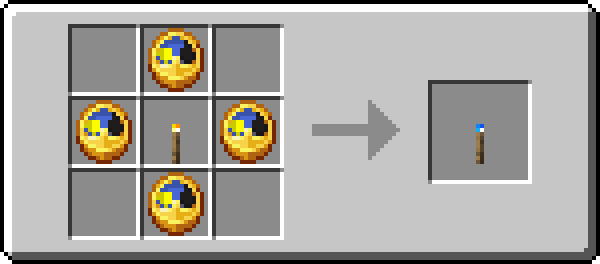
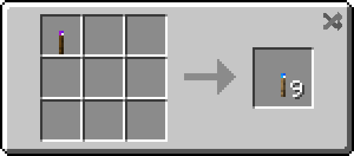
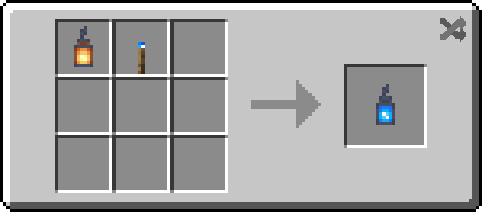
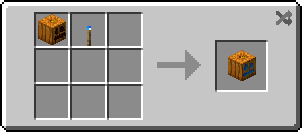
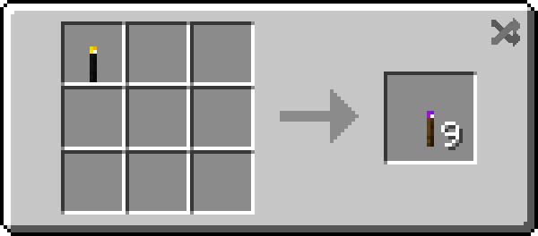
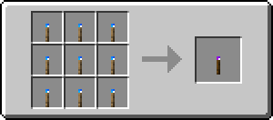
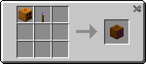
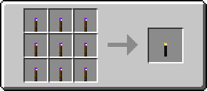
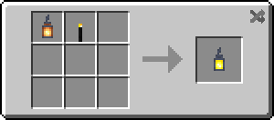
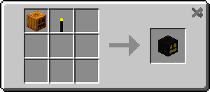

# Recipe

**Torcherino**

**lantern**

**lanterino**

**compressed torcherino**

**compressed lantern**

**compressed lanterino**

**double_compressed_torcherino**

**double_compressed_lantern**

**double_compressed_lanterino**

<AdUnit />
