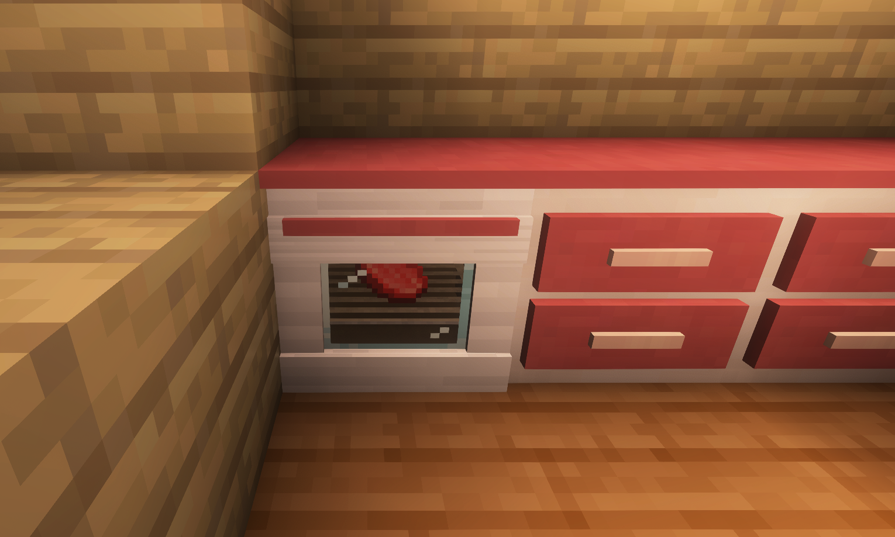
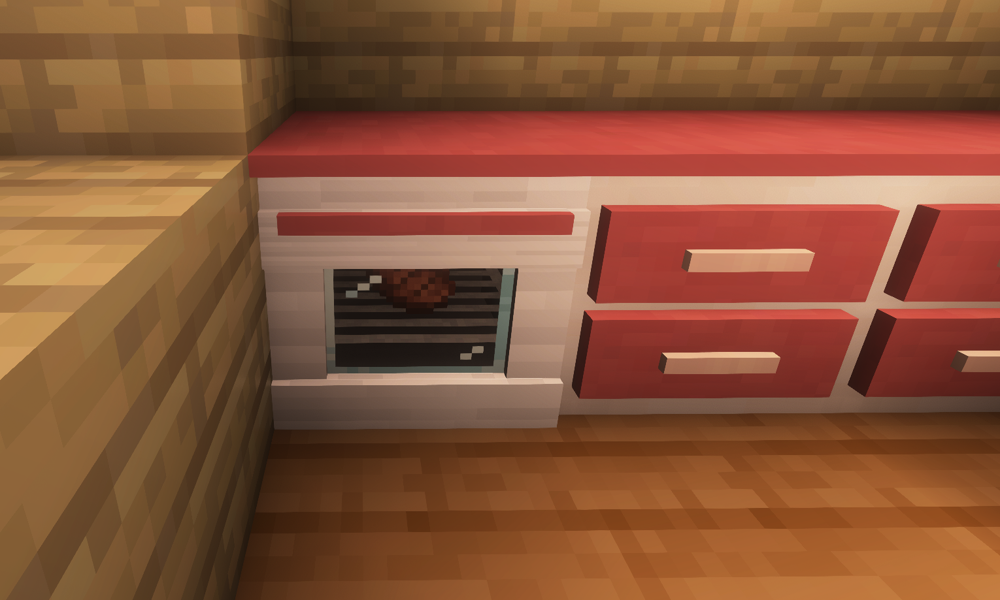
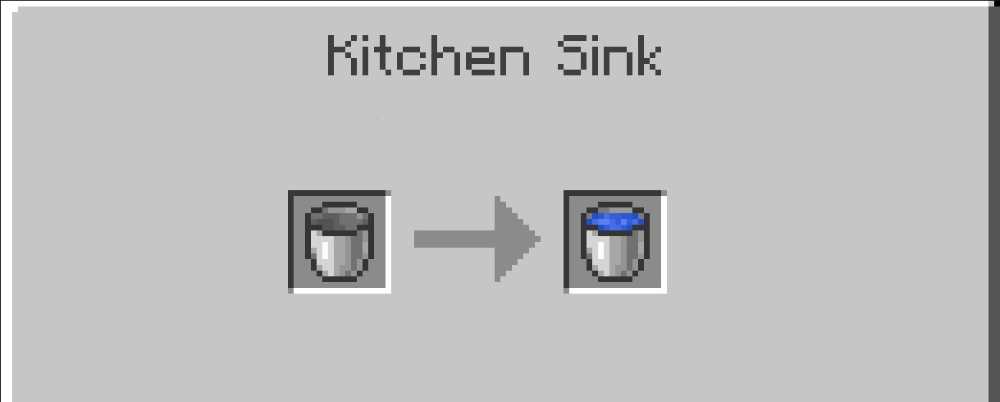
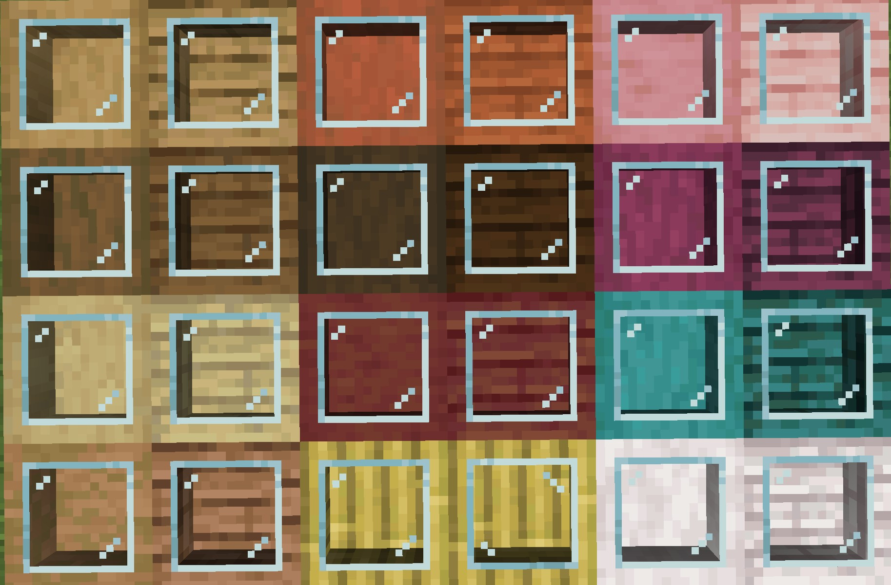
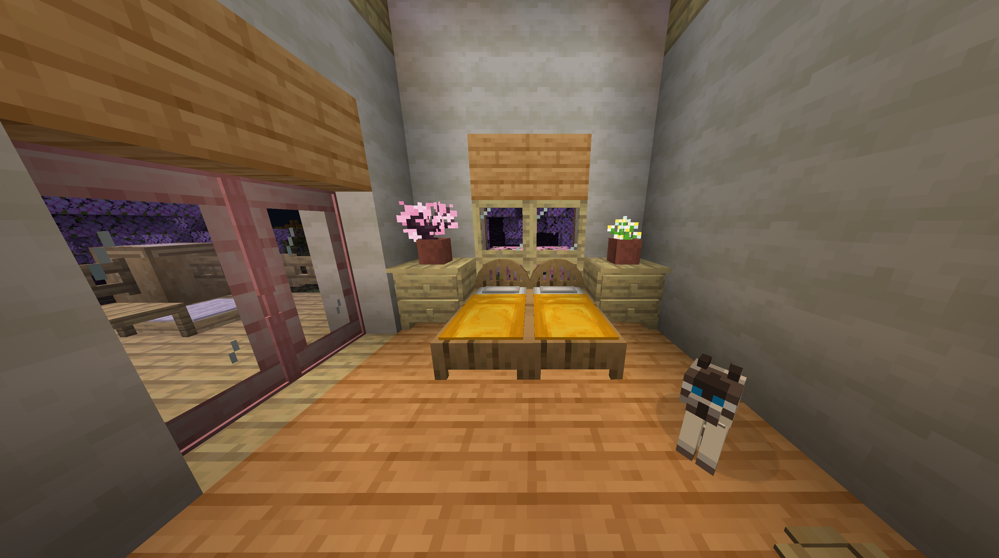
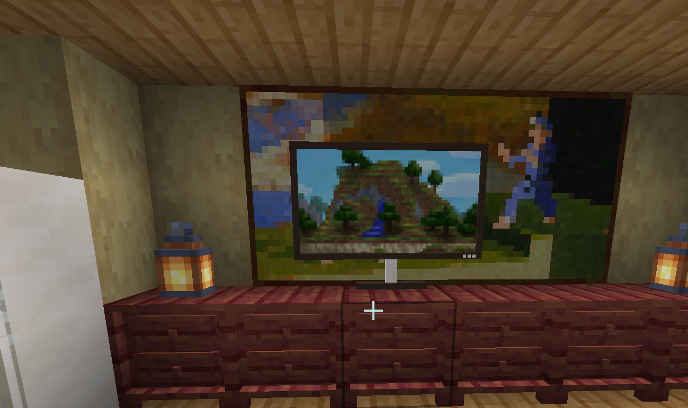

# 功能

### 烤箱

烤箱使用与原版烟熏炉相同的配方。

### 盘子

您可以右键点击将物品放到盘子上，也可以取下来。

### 厨房水槽

您可以将桶放入水槽中，它会被自动装满水。

### 柜子

您可以像使用原版箱子一样将物品放入柜子中。四格柜和三格柜会显示内部存放的物品。

### **吸顶灯**

吸顶灯可以通过右键点击来打开和关闭——一个简单的光源。

<AdUnit />

### 椅子/沙发/咖啡椅/坐垫

右键点击坐在椅子、沙发、咖啡椅或坐垫上，按 Shift 键起身。

### 玻璃桌
- 引入了**玻璃桌**。
- 可以**存放最多 9 个物品（3×3 网格）**。
- 存放的物品会**在玻璃表面下方清晰可见**，增添了装饰性和功能性的触感。

### 新床

- 添加了全新的床设计，适合现代和经典内饰。
- 多种颜色变体，便于灵活装饰。
  

### 电视

- 引入了电视方块作为新的装饰性家具。
- 非常适合搭配沙发、桌子等打造完整的客厅布局。
  

  <AdUnit />

