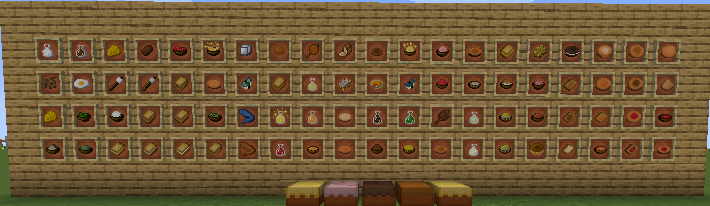

# UsefulFood Reborn
在 Minecraft 中添加更多新食物。这是 UsefulFood 的更新版本重写。

#### 在 Minecraft 中添加更多新食物。这是 UsefulFood 的更新版本重写。

#### 我完全重写了代码，但纹理仍然使用 UsefulFood 1.8 的纹理。因此代码使用 MIT 许可证。纹理使用公有领域许可证（UsefulFood 使用它）。

#### 翻译
您可以通过我们的 [Crowdin](https://crowdin.com/project/usefulfood-reborn) 页面提交 UsefulFood Reborn 的翻译。如果您会任何语言，请考虑帮助我们！或者，您也可以通过 pull requests 提交翻译。

#### 这个模组的目标是尽可能多地向 Minecraft 添加有用的食物，而不破坏它的原版感觉。没有极端和复杂的配方！该模组应该是简单而实用的，让您可以利用通常不能用来制作食物的东西来制作食物，并添加各种各样的食物，使 Minecraft 更加有趣。

#### 功能
70+ 食物物品
鱿鱼的新生物掉落物。
蛋糕！
果汁和冰沙
馅饼、三明治、汤
冰淇淋
<AdUnit />

